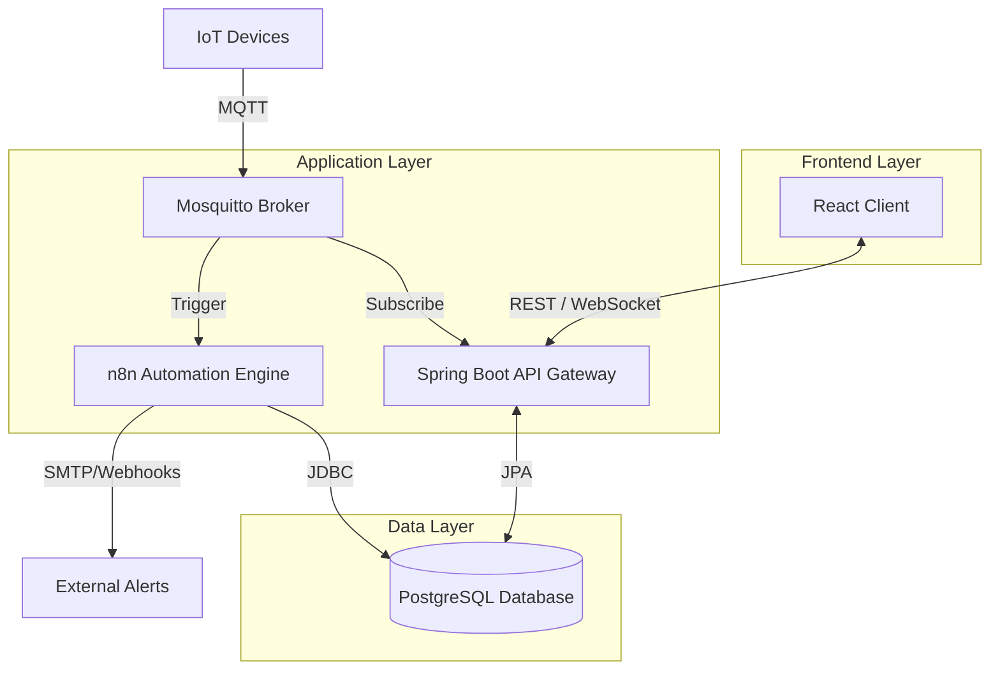
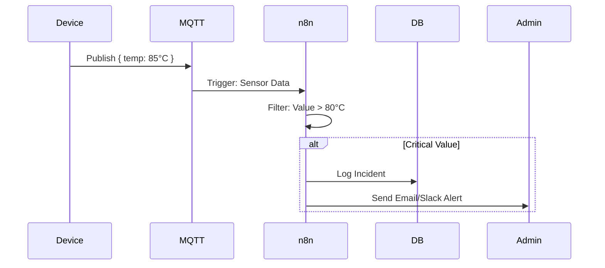

# 🌐 Sensor_Net IoT Platform


> **A modern, scalable, and production-ready IoT monitoring solution integrating real-time telemetry, automated workflows, and robust data visualization.**

---

## 📖 Overview

**Sensor_Net** is a full-stack IoT platform designed to bridge the gap between hardware sensors and actionable intelligence. It provides real-time monitoring of device telemetry, automated alert handling via **n8n**, and a high-performance backend built on **Spring Boot** and **PostgreSQL**.

The frontend delivers a futuristic, reliable dashboard experience using **React**, **TypeScript**, and **Tailwind CSS**, ensuring that critical data is visualized with precision and style.

## ✨ Key Features

-   **🚀 Real-Time Monitoring**: Live visualization of sensor data using WebSockets and Recharts.
-   **⚡ High-Performance Backend**: Spring Boot architecture with effective rate limiting (Bucket4j) and modular design.
-   **🤖 Automation & Workflows**: Integrated **n8n** workflows for complex event processing and automated alerting.
-   **📡 Protocol Support**: Native MQTT support using Eclipse Mosquitto for reliable device communication.
-   **🔒 Secure & Scalable**: Role-based access control (Admin, User, Viewer) and Dockerized deployment.
-   **🎨 Modern UI/UX**: Glassmorphism design, dark mode, and responsive layout.

---

## 🏗️ System Architecture

The system follows a microservices-based architecture, orchestrated via Docker Compose.



---

## 🛠️ Tech Stack

| Component | Technology | Description |
| :--- | :--- | :--- |
| **Frontend** | React, TypeScript, Vite | High-performance SPA with strict type safety. |
| **Styling** | Tailwind CSS, Lucide React | Modern, utility-first styling with premium icons. |
| **Backend** | Spring Boot 3, Java 17 | Robust REST API and WebSocket handling. |
| **Database** | PostgreSQL, Flyway | Relational data storage with versioned migrations. |
| **Messaging** | Eclipse Mosquitto (MQTT) | Lightweight messaging protocol for sensors. |
| **Automation** | n8n | Low-code workflow automation for event handling. |
| **DevOps** | Docker, Docker Compose | Containerized application lifecycle management. |

---

## 📂 Project Structure

```bash
Sensor_Net/
├── sensor-net-api/       # Spring Boot Backend & API
├── sensor-net-core/      # Core business logic & Data Access Layer
├── sensor-net-frontend/  # React/Vite Frontend Application
├── sensor-net-mqtt/      # MQTT Integration & Handlers
├── sensor-net-plugins/   # Extensible Plugin System
├── docker-compose.yml    # Container orchestration
└── pom.xml               # Maven Parent POM
```

---

## 🔄 Automation Workflows (n8n)

Sensor_Net leverages **n8n** to handle complex logic off the main application path.

### Critical Alert Workflow

This workflow triggers whenever a sensor reports a value exceeding critical thresholds.



---

## 🚀 Getting Started

### Prerequisites

-   **Java 17+** (JDK)
-   **Node.js 18+** & **npm**
-   **Docker** & **Docker Compose**
-   **Maven** (Optional, wrapper included)

### Installation

1.  **Clone the Repository**
    ```bash
    git clone https://github.com/yourusername/sensor-net.git
    cd sensor-net
    ```

2.  **Start Infrastructure (Database, MQTT, n8n)**
    ```bash
    docker-compose up -d
    ```

3.  **Build & Run Backend**
    ```bash
    # Install dependencies
    mvn clean install

    # Run the API module
    cd sensor-net-api
    mvn spring-boot:run
    ```

4.  **Start Frontend**
    ```bash
    cd sensor-net-frontend
    npm install
    npm run dev
    ```

5.  **Access the Application**
    -   **Frontend**: `http://localhost:5173`
    -   **API Swagger**: `http://localhost:8080/swagger-ui.html`
    -   **n8n Editor**: `http://localhost:5678`

---

## 🔌 API Documentation

| Method | Endpoint | Description |
| :--- | :--- | :--- |
| `GET` | `/api/v1/devices` | List all registered devices |
| `POST` | `/api/v1/devices` | Register a new device |
| `GET` | `/api/v1/telemetry/{id}` | Get historical data for a device |
| `WS` | `/ws/topic/telemetry` | WebSocket subscription for real-time updates |

---

## 🤝 Contributing

Contributions are welcome! Please fork the repository and submit a pull request for any enhancements or bug fixes.

1.  Fork the Project
2.  Create your Feature Branch (`git checkout -b feature/AmazingFeature`)
3.  Commit your Changes (`git commit -m 'Add some AmazingFeature'`)
4.  Push to the Branch (`git push origin feature/AmazingFeature`)
5.  Open a Pull Request

---

## 📄 License

Distributed under the MIT License. See `LICENSE` for more information.
